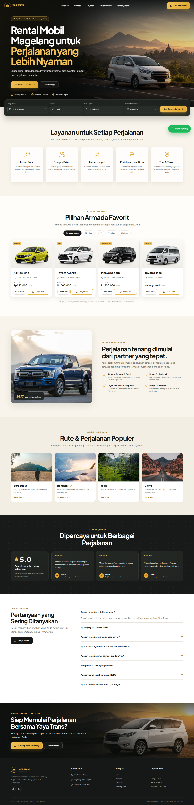

# Yaya Trans Tour & Travel

Website rental mobil dan layanan perjalanan untuk **CV. Yaya Trans Tour & Travel** di Magelang. Redesign ini berfokus pada presentasi armada yang jelas, kepercayaan pelanggan, pengalaman responsif, SEO lokal, dan konversi pemesanan melalui WhatsApp.



## Tentang Proyek

Yaya Trans diposisikan sebagai **Partner Rental Mobil & Perjalanan Magelang–Jogja**. Website menyediakan informasi layanan, armada, rute populer, FAQ, serta formulir pengecekan ketersediaan tanpa database atau sistem pembayaran yang kompleks.

Data dari formulir booking diubah menjadi pesan WhatsApp yang sudah terformat sehingga pelanggan dapat langsung melanjutkan konsultasi dengan admin.

## Fitur Utama

- Hero sinematik dengan CTA WhatsApp dan indikator kepercayaan.
- Quick booking untuk tanggal, durasi, jenis layanan, dan jumlah penumpang.
- Filter armada berdasarkan kategori kendaraan.
- Pesan WhatsApp otomatis untuk pemesanan kendaraan dan konsultasi rute.
- Informasi layanan lepas kunci, driver, antar-jemput, luar kota, dan tour.
- Daftar rute populer dari Magelang.
- Testimoni dan rating dalam status konten draft.
- FAQ accordion yang aksesibel.
- Sticky navigation, drawer mobile, floating CTA, dan mobile bottom CTA.
- Metadata dasar untuk pencarian rental mobil Magelang.
- Layout responsif untuk desktop, tablet, dan mobile.
- Dukungan `prefers-reduced-motion` untuk aksesibilitas.

> Harga, spesifikasi kendaraan, rating, testimoni, alamat, dan ketersediaan yang tampil masih berupa data draft. Seluruh data harus dikonfirmasi sebelum website dipublikasikan sebagai website resmi.

## Teknologi

- [Next.js 16](https://nextjs.org/)
- [React 19](https://react.dev/)
- TypeScript
- CSS responsif khusus
- [Lucide Icons](https://lucide.dev/)
- Next.js Image dan Google Fonts

## Struktur Proyek

```text
webrental02/
├── app/
│   ├── data.ts          # Data layanan, armada, rute, FAQ, dan WhatsApp
│   ├── globals.css      # Design system dan styling responsif
│   ├── layout.tsx       # Root layout, font, dan metadata SEO
│   └── page.tsx         # Homepage dan komponen interaktif
├── public/
│   └── cars/            # Ilustrasi kendaraan lokal
├── tests/
│   ├── screenshots/     # Hasil pemeriksaan visual
│   └── visual_check.py  # Pemeriksaan browser dengan Playwright
├── next.config.ts
├── package.json
└── tsconfig.json
```

## Menjalankan Secara Lokal

### Prasyarat

- Node.js 20.9 atau lebih baru
- npm

### Instalasi

```bash
git clone https://github.com/hmad28/rentalmobil02.git
cd rentalmobil02
npm install
```

### Development

```bash
npm run dev
```

Buka [http://localhost:3000](http://localhost:3000). Jika port 3000 sedang digunakan, jalankan:

```bash
npm run dev -- -p 3107
```

### Build Produksi

```bash
npm run build
npm run start
```

### Pemeriksaan TypeScript

```bash
npm run lint
```

## Konfigurasi Konten

Konten utama dapat diperbarui dari [`app/data.ts`](app/data.ts):

- `services` untuk layanan Yaya Trans.
- `fleet` untuk kendaraan, kapasitas, transmisi, dan harga.
- `routes` untuk destinasi dan perjalanan populer.
- `faqs` untuk pertanyaan dan jawaban.
- `whatsappNumber` untuk nomor tujuan seluruh CTA WhatsApp.

Konten hero, bagian keunggulan, testimoni, footer, dan CTA akhir berada di [`app/page.tsx`](app/page.tsx).

## Pengujian

Implementasi telah diperiksa pada viewport desktop `1440 × 1000` dan mobile `390 × 844`. Pemeriksaan meliputi:

- Tidak ada horizontal overflow.
- Hanya terdapat satu elemen `h1`.
- Filter armada bekerja.
- Drawer navigasi mobile dapat dibuka.
- Tidak ada error pada browser console.
- Build produksi dan TypeScript berhasil.

## Catatan Aset

Foto katalog kendaraan hasil generate disimpan secara lokal dalam format WebP transparan di `public/cars`. Beberapa foto perjalanan menggunakan gambar eksternal dari Unsplash dan membutuhkan koneksi internet. Untuk penggunaan produksi, aset armada tetap perlu dicocokkan dengan unit asli Yaya Trans, sedangkan foto perjalanan sebaiknya diganti dengan dokumentasi resmi yang telah dioptimalkan.

## Deployment

Aplikasi dapat diterapkan pada platform yang mendukung Next.js, seperti Vercel, atau dijalankan menggunakan Node.js setelah proses `npm run build` selesai.

---

Dibuat untuk modernisasi website **CV. Yaya Trans Tour & Travel** dan penguatan pencarian lokal rental mobil Magelang.
